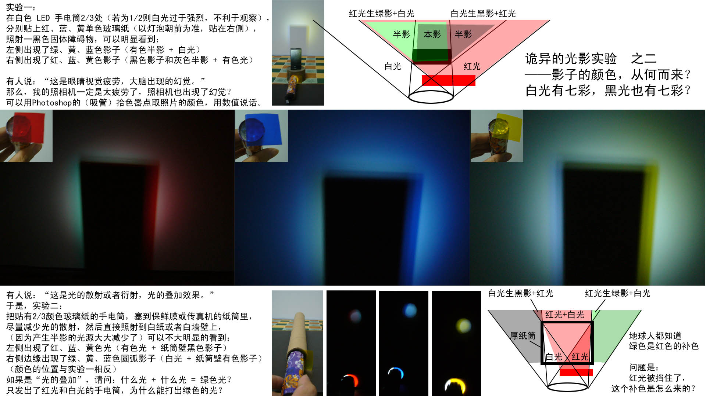
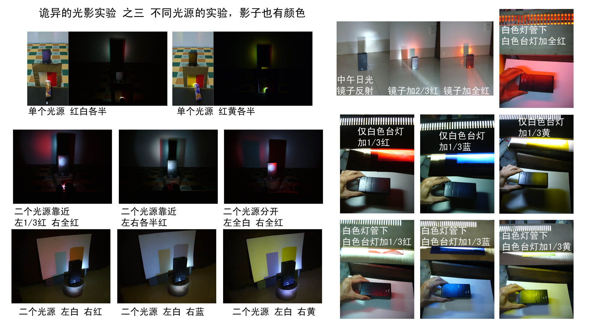

红光绿影（科学实验）
======

  
  
  
  

网页浏览请转到：
------
https://yq-ysy.github.io/R_light_G_shadow/  

说明
------
以上二图是我在知乎 2016-09-29 提出的问题，无人回答：  
《你在家也能做的“诡异的光影实验”（有照片），阴影的颜色从何而来？》  
https://www.zhihu.com/question/51135677  
我于 2025-02-03 向 DeepSeek 深度思索 R1 提问（纯文字、无图片），  
　  
经过三次有效问答，得到现象解释、数学推导、创新实验设计、公式验证与拓展。  
详细过程如下所示，请各位科研专业人士严谨判断 AI 的解析是否正确。  
希望能为光学显像产业应用开拓出一个崭新的方向。  
我一善鱼，电子邮箱：yq-ysy@163.com  

打包下载
------
https://github.com/YQ-YSY/R_light_G_shadow/archive/refs/heads/main.zip  
https://gitee.com/yq-ysy/R_light_G_shadow/repository/archive/main.zip  
　  
